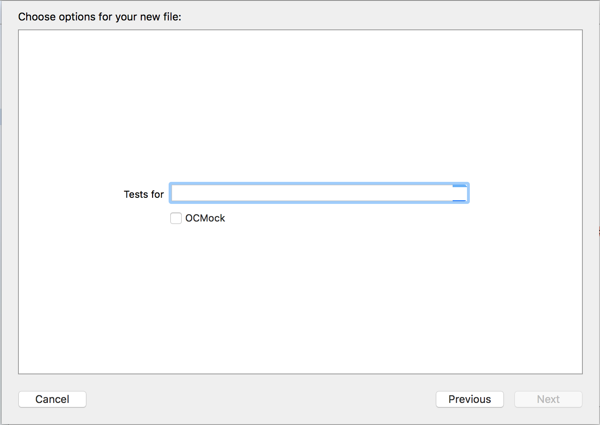

# Xcode-Snapshots-Specta-Templates
Xcode file template for [snapshots unit tests](https://github.com/facebook/ios-snapshot-test-case) using [ios-snapshot-test-case-expecta](https://github.com/dblock/ios-snapshot-test-case-expecta). Also supports importing OCMock.

# Installation & Usage

* Copy the folder `Snapshots Templates` of this repository into `/Library/Developer/Xcode/Templates/Application/File Templates`.
* Relaunch Xcode and select "File > New File", or use the ⌘N keyboard shortcut.
* Select the "Snapshots Templates" category, then select the "Snapshot Unit Tests" template, and hit "Next".
* Enter the name of the class you want to create tests for and whether you'd like to use OCMock.



Here's an example of a generated test:

```objc
//
//  MyViewTests.h
//  MyProject
//
//  Created by Marcelo Fabri on 30/04/16.
//  Copyright (c) 2016 MyCompany. All rights reserved.
//

#import <Expecta+Snapshots/EXPMatchers+FBSnapshotTest.h>
#import <Specta/Specta.h>

#import "MyView.h"

SpecBegin(MyView)

it(@"does something", ^{
    expect(view).to.haveValidSnapshot();
});

SpecEnd
```

# License
Xcode Snapshots Specta File Template is available under the MIT license. See the LICENSE file for more info.
